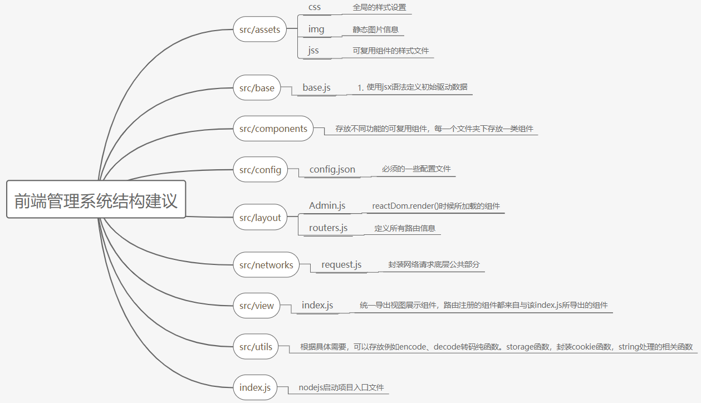

#  组件可重用列表清单

frontend_lib存储库中

## Card

基础组件：src/packages/components/Card :卡片相关

| Card       | 卡片组件，一般用于侧边栏导航后的组件展示 |
| ---------- | ---------------------------------------- |
| CardAvatar |                                          |
| CardBody   | 卡片组件结构的数据展示区域               |
| CardFooter | 卡片组件结构的底部位置                   |
| CardHeader | 卡片组件结构的头部位置                   |
| CardIcon   | 图标                                     |

----

## CustomButtons

基础组件：src/packages/components/CustomButtons

| RegularButton | 按钮组件 |
| :------------ | -------- |

----

## CustomInput

基础组件：src/packages/components/CustomInput

| CustomInput | 输入框组件 |
| ----------- | ---------- |

----

## CustomTabs

基础组件：src/packages/components/CustomTabs

| CustomITabs | 一个表格组件的头部 |
| ----------- | ------------------ |

----

## FixedPlugin

基础组件：src/packages/components/FixedPlugin

| FixedPlugin | 用于控制整体页面布局的状态变化组件 |
| ----------- | ---------------------------------- |

----

## Footer

路径：src/packages/components/Footer

| Footer | 整体布局的底部组件 |
| ------ | ------------------ |

----

----

## Grid

路径：src/packages/components/Grid

| GridContainer | 网格容器组件，一般包含GridItem组件 |
| ------------- | ---------------------------------- |
| GridItem      | 网格组件，有响应式效果             |

----

## Navbars

路径：src/packages/components/Navbars

| AdminNavbarLinks | 顶部导航栏的消息提示组件   |
| ---------------- | -------------------------- |
| Header           | 页面布局的头部位置展示组件 |

------

## Sidebar

路径：src/packages/components/Sidebar

| Sidebar          | 侧边栏绑定路由后的组件，未嵌套子项   |
| ---------------- | ------------------------------------ |
| SiderBarCollapse | 侧边栏组件，嵌套有一个子项结构的组件 |

------

## SnackBar

路径：src/packages/components/SnackBar

| Snackbar        | 提示框，页面状态改变后的提示信息   |
| --------------- | ---------------------------------- |
| SnackbarContent | 提示框，可以包含一个栅格容器的组件 |

------

## Table

路径：src/packages/components/Table

| CustomTable | 表格组件，常用于遍历一个数据集合，展示一个表格视图 |
| ----------- | -------------------------------------------------- |
|             |                                                    |

------

## Tasks

路径：src/packages/components/Tasks

| Tasks | 用于遍历一个表格结构的数据视图 |
| ----- | ------------------------------ |
|       |                                |

----

## Typography

路径：src/packages/components/Typography

| Danger  | 一个红色字体的段落，响应式 |
| ------- | -------------------------- |
| Info    | 一个蓝色字体的段落         |
| Muted   | 灰色字体的段落             |
| Primary | 一个紫色字体的段落         |
| Quote   | 含有引用的一个段落         |
| Success | 一个绿色字体的段落         |
| Warning | 一个橙色字体的段落         |

----

## layout

路径：src/layout

| Admin         | 响应式页面布局第一个加载的文件，侧边栏没有折叠项           |
| ------------- | ---------------------------------------------------------- |
| AdminCollapse | 响应式页面布局第一个加载的文件，侧边栏可以是二级菜单的形式 |

前端管理系统项目结构建议：

